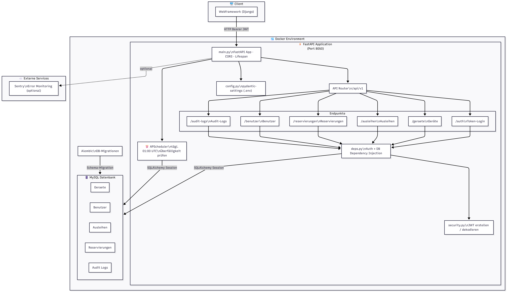

# Device Management Backend

REST-API für ein Geräteverwaltungssystem — entwickelt mit **FastAPI**, **SQLAlchemy** und **MySQL**. Die Anwendung ermöglicht das Verwalten von Geräten, Ausleihen, Reservierungen und Benutzern, inklusive QR-Code- und NFC-Unterstützung, Bildspeicherung via MinIO sowie Audit-Logging.


## Architektur



---

## Tech-Stack

| Komponente    | Technologie                  |
|---------------|------------------------------|
| Framework     | FastAPI 0.135                |
| ORM           | SQLAlchemy 2.0               |
| Datenbank     | MySQL 8.0                    |
| Migrationen   | Alembic                      |
| Auth          | JWT (PyJWT, HS256)           |
| Scheduler     | APScheduler                  |
| QR-Codes      | qrcode + Pillow              |
| Bildspeicher  | MinIO (S3-kompatibel)        |
| E-Mail        | SMTP (Mailpit im Dev-Betrieb)|
| Monitoring    | Sentry (optional)            |
| Server        | Uvicorn                      |
| Container     | Docker + Docker Compose      |

---

## Projektstruktur

```
device_management_backend/
├── app/
│   ├── api/
│   │   ├── deps.py             # Auth + DB Dependency Injection
│   │   └── v1/
│   │       ├── endpoints/      # Route-Handler (auth, geraete, ausleihen, …)
│   │       └── router.py
│   ├── core/
│   │   ├── config.py           # Einstellungen via Pydantic Settings
│   │   ├── mail.py             # SMTP E-Mail-Versand
│   │   ├── minio_client.py     # MinIO-Client-Factory
│   │   ├── scheduler.py        # Hintergrund-Jobs
│   │   └── security.py         # JWT-Erstellung & Dekodierung
│   ├── crud/                   # Datenbankoperationen
│   ├── db/                     # Session & Base-Klasse
│   ├── models/                 # SQLAlchemy-Modelle
│   ├── schemas/                # Pydantic-Schemas (Request/Response)
│   └── main.py                 # App-Einstiegspunkt
├── alembic/                    # Migrationsskripte
├── alembic.ini
├── docker-compose.yml
├── Dockerfile
├── entrypoint.sh
└── requirements.txt
```

---

## API-Endpunkte (`/api/v1`)

| Prefix                        | Tag             | Beschreibung                                          |
|-------------------------------|-----------------|-------------------------------------------------------|
| `/auth`                       | Auth            | Login, Token-Vergabe, aktueller Nutzer                |
| `/sso`                        | SSO             | SSO-Callback: OTT gegen JWT tauschen (Shibboleth)     |
| `/geraete`                    | Geräte          | CRUD-Operationen, QR-Code, Bild-URL                   |
| `/geraete/{id}/qr-code`       | QR & NFC        | QR-Code generieren (PNG mit Beschriftung oder SVG)    |
| `/geraete/{id}/nfc-payload`   | QR & NFC        | NFC NDEF-Payload abrufen                              |
| `/geraete/{id}/scan-ausleihe` | QR & NFC        | QR-Scan → Ausleihe direkt starten                     |
| `/geraete/{id}/scan-rueckgabe`| QR & NFC        | QR-Scan → Rückgabe durchführen (Admin)                |
| `/nfc/resolve`                | QR & NFC        | NFC-URL zu Gerätedaten auflösen                       |
| `/bildungseinrichtungen`      | Standorte       | CRUD für Bildungseinrichtungen                        |
| `/standorte`                  | Standorte       | CRUD für Standorte                                    |
| `/boxen`                      | Standorte       | CRUD für Boxen (Aufbewahrungseinheiten)               |
| `/ausleihen`                  | Ausleihen       | Ausleihe starten, verlängern, zurückgeben             |
| `/reservierungen`             | Reservierungen  | Reservierungen anlegen & stornieren                   |
| `/benutzer`                   | Benutzer        | Benutzerverwaltung                                    |
| `/audit-logs`                 | Audit-Logs      | Nachvollziehbare Aktionshistorie                      |
| `/admin/bilder`               | Bilder          | Bild hochladen (Admin)                                |
| `/admin/geraete`              | Bilder          | Bild einem Gerät zuweisen (Admin)                     |
| `/export/ausleihen`           | Export          | Ausleihdaten als CSV exportieren (Admin)              |
| `/statistik`                  | Statistik       | Aggregierte Systemkennzahlen (Admin)                  |
| `/admin/scheduler`            | Scheduler       | Scheduler-Jobs manuell auslösen (Admin)               |

### Bild-Endpunkte im Detail

| Methode | Pfad                                  | Berechtigung | Beschreibung                              |
|---------|---------------------------------------|--------------|-------------------------------------------|
| `POST`  | `/api/v1/admin/bilder`                | Admin        | Neues Bild hochladen → gibt `bild_id` zurück |
| `PUT`   | `/api/v1/admin/geraete/{id}/bild`     | Admin        | Vorhandenes Bild einem Gerät zuweisen     |
| `GET`   | `/api/v1/geraete/{id}/bild`           | Alle         | Presigned-URL (1 h) für das Gerätebild   |

Die interaktive API-Dokumentation ist unter `/api/v1/openapi.json` erreichbar (Swagger UI: `/docs`, Redoc: `/redoc`).

---

## Datenmodell

### Standort-Hierarchie

Geräte werden über eine dreigliedrige Standorthierarchie verortet:

```
Bildungseinrichtung  →  Standort (Gebäude/Raum)  →  Box  →  Gerät
```

---

### Datenbanktabellen

#### `bildungseinrichtungen`

| Spalte          | Typ           | Constraints       | Beschreibung              |
|-----------------|---------------|-------------------|---------------------------|
| `id`            | INT           | PK, AUTO_INCREMENT| Primärschlüssel           |
| `name`          | VARCHAR(255)  | NOT NULL          | Name der Einrichtung      |
| `strasse`       | VARCHAR(255)  |                   | Straße                    |
| `hausnummer`    | VARCHAR(20)   |                   | Hausnummer                |
| `plz`           | VARCHAR(10)   |                   | Postleitzahl              |
| `ort`           | VARCHAR(255)  |                   | Ort                       |
| `bundesland`    | VARCHAR(255)  |                   | Bundesland                |

#### `standorte`

| Spalte                    | Typ          | Constraints               | Beschreibung                        |
|---------------------------|--------------|---------------------------|-------------------------------------|
| `id`                      | INT          | PK, AUTO_INCREMENT        | Primärschlüssel                     |
| `bildungseinrichtung_id`  | INT          | FK → bildungseinrichtungen, NOT NULL | Zugehörige Bildungseinrichtung |
| `gebaeude`                | VARCHAR(255) |                           | Gebäudebezeichnung                  |
| `raum`                    | VARCHAR(100) |                           | Raum                                |
| `beschreibung`            | TEXT         |                           | Freitext-Beschreibung               |

#### `boxen`

| Spalte         | Typ          | Constraints           | Beschreibung              |
|----------------|--------------|-----------------------|---------------------------|
| `id`           | INT          | PK, AUTO_INCREMENT    | Primärschlüssel           |
| `box_nummer`   | VARCHAR(50)  |                       | Bezeichnung der Box       |
| `standort_id`  | INT          | FK → standorte, NOT NULL | Zugehöriger Standort   |
| `beschreibung` | TEXT         |                       | Freitext-Beschreibung     |

#### `geraet_bilder`

| Spalte           | Typ          | Constraints           | Beschreibung                       |
|------------------|--------------|-----------------------|------------------------------------|
| `id`             | INT          | PK, AUTO_INCREMENT    | Primärschlüssel                    |
| `dateiname`      | VARCHAR(255) | NOT NULL, UNIQUE      | Dateiname im MinIO-Bucket          |
| `mime_type`      | VARCHAR(50)  | NOT NULL              | MIME-Typ (z. B. `image/jpeg`)      |
| `hochgeladen_am` | DATETIME(tz) | NOT NULL              | Upload-Zeitstempel (UTC)           |

#### `geraete`

| Spalte                 | Typ           | Constraints              | Beschreibung                                              |
|------------------------|---------------|--------------------------|-----------------------------------------------------------|
| `id`                   | INT           | PK, AUTO_INCREMENT       | Primärschlüssel                                           |
| `inventar_nummer`      | VARCHAR(50)   | NOT NULL, UNIQUE, INDEX  | Inventarnummer                                            |
| `name`                 | VARCHAR(100)  | NOT NULL                 | Anzeigename                                               |
| `unique_name`          | VARCHAR(150)  | UNIQUE, INDEX            | Auto-generierter Name `{Kategorie}-{Hersteller}-{Nr}`     |
| `kategorie`            | VARCHAR(50)   | INDEX                    | Gerätekategorie (z. B. `Laptop`)                          |
| `hersteller`           | VARCHAR(50)   |                          | Hersteller                                                |
| `modell`               | VARCHAR(50)   |                          | Modellbezeichnung                                         |
| `seriennummer`         | VARCHAR(100)  | UNIQUE                   | Seriennummer                                              |
| `status`               | ENUM          | NOT NULL, DEFAULT `verfügbar` | Gerätestatus (siehe unten)                           |
| `anschaffungsdatum`    | DATE          |                          | Kaufdatum                                                 |
| `bemerkungen`          | TEXT          |                          | Freitext-Bemerkungen                                      |
| `bild_id`              | INT           | FK → geraet_bilder       | Zugewiesenes Bild                                         |
| `box_id`               | INT           | FK → boxen               | Aufbewahrungsbox                                          |
| `langzeit_ausleihe`    | BOOLEAN       | NOT NULL, DEFAULT `false`| Erlaubt Langzeit-Verlängerung (bis zu 80 Tage)            |

**ENUM `GeraeteStatus`:** `verfügbar` · `ausgeliehen` · `reserviert` · `defekt` · `außer Betrieb` · `zur Zeit nicht vorhanden`

#### `benutzer`

| Spalte           | Typ          | Constraints           | Beschreibung                        |
|------------------|--------------|-----------------------|-------------------------------------|
| `id`             | INT          | PK, AUTO_INCREMENT    | Primärschlüssel                     |
| `shibboleth_id`  | VARCHAR(100) | NOT NULL, UNIQUE, INDEX | SSO-Identifikator (Shibboleth)    |
| `name`           | VARCHAR(150) | NOT NULL              | Vollständiger Name                  |
| `email`          | VARCHAR(150) | NOT NULL, UNIQUE      | E-Mail-Adresse                      |
| `rolle`          | ENUM         | NOT NULL, DEFAULT `Studierende_Mitarbeitende` | Benutzerrolle (siehe unten) |

**ENUM `BenutzerRolle`:** `Studierende_Mitarbeitende` · `Administrator`

#### `ausleihen`

| Spalte                           | Typ      | Constraints                  | Beschreibung                                        |
|----------------------------------|----------|------------------------------|-----------------------------------------------------|
| `id`                             | INT      | PK, AUTO_INCREMENT           | Primärschlüssel                                     |
| `geraet_id`                      | INT      | FK → geraete, NOT NULL       | Ausgeliehenes Gerät                                 |
| `nutzer_id`                      | INT      | FK → benutzer, NOT NULL      | Ausleihender Nutzer                                 |
| `startdatum`                     | DATETIME | NOT NULL                     | Ausleihbeginn (UTC)                                 |
| `geplantes_rueckgabedatum`       | DATETIME | NOT NULL                     | Geplantes Rückgabedatum                             |
| `tatsaechliches_rueckgabedatum`  | DATETIME |                              | Tatsächliches Rückgabedatum                         |
| `status`                         | ENUM     | NOT NULL, DEFAULT `aktiv`    | Ausleihstatus (siehe unten)                         |
| `verlaengerungen_anzahl`         | INT      | NOT NULL, DEFAULT `0`        | Anzahl der Verlängerungen                           |
| `erinnerung_gesendet`            | BOOLEAN  | NOT NULL, DEFAULT `false`    | Frist-Erinnerungs-E-Mail wurde gesendet             |
| `mahnung_gesendet`               | BOOLEAN  | NOT NULL, DEFAULT `false`    | Mahnungs-E-Mail wurde gesendet                      |
| `zustand_bei_rueckgabe`          | TEXT     |                              | Zustandsbeschreibung bei Rückgabe                   |
| `langzeit_verlaengerung_genutzt` | BOOLEAN  | NOT NULL, DEFAULT `false`    | Langzeit-Verlängerung (80 Tage) wurde bereits genutzt |

**ENUM `AusleihStatus`:** `aktiv` · `überfällig` · `abgeschlossen`

#### `reservierungen`

| Spalte                  | Typ          | Constraints                  | Beschreibung                                         |
|-------------------------|--------------|------------------------------|------------------------------------------------------|
| `id`                    | INT          | PK, AUTO_INCREMENT           | Primärschlüssel                                      |
| `geraet_id`             | INT          | FK → geraete, NOT NULL       | Reserviertes Gerät                                   |
| `nutzer_id`             | INT          | FK → benutzer, NOT NULL      | Reservierender Nutzer                                |
| `erstellt_am`           | DATETIME     | NOT NULL                     | Erstellungszeitpunkt (UTC)                           |
| `reserviert_fuer_datum` | DATE         | NOT NULL                     | Datum, für das reserviert wird                       |
| `ablaufdatum`           | DATETIME(tz) |                              | Ablaufzeitpunkt (Standard: +3 Tage ab Erstellung)    |
| `status`                | ENUM         | NOT NULL, DEFAULT `aktiv`    | Reservierungsstatus (siehe unten)                    |

**ENUM `ReservierungsStatus`:** `aktiv` · `erfüllt` · `storniert`

#### `audit_logs`

| Spalte        | Typ      | Constraints                  | Beschreibung                             |
|---------------|----------|------------------------------|------------------------------------------|
| `id`          | INT      | PK, AUTO_INCREMENT           | Primärschlüssel                          |
| `zeitstempel` | DATETIME | NOT NULL, INDEX              | Zeitpunkt der Aktion (UTC)               |
| `nutzer_id`   | INT      | FK → benutzer, NOT NULL      | Ausführender Nutzer                      |
| `geraet_id`   | INT      | FK → geraete                 | Betroffenes Gerät (optional)             |
| `aktion`      | ENUM     | NOT NULL                     | Art der Aktion (siehe unten)             |
| `details`     | TEXT     |                              | Freitext-Details zur Aktion              |

**ENUM `AktionType`:** `angelegt` · `bearbeitet` · `status_änderung` · `ausleihe` · `verlängerung` · `rückgabe` · `reservierung`

---

## Lokales Setup (ohne Docker)

### Voraussetzungen
- Python 3.12+
- MySQL-Datenbank

### Installation

```bash
# Repository klonen
git clone <repo-url>
cd device_management_backend

# Virtuelle Umgebung anlegen und aktivieren
python -m venv .venv
source .venv/bin/activate  # Windows: .venv\Scripts\activate

# Abhängigkeiten installieren
pip install -r requirements.txt
```

### Umgebungsvariablen

`.env`-Datei im Projektverzeichnis anlegen:

```env
ENV=development

DB_HOST=localhost
DB_PORT=3306
DB_USER=root
DB_PASSWORD=dein_passwort
DB_NAME=device_management

SECRET_KEY=dein_geheimer_schluessel

CORS_ORIGINS=["http://localhost:3000","http://localhost:5173"]
BASE_URL=http://localhost:8050

# MinIO
MINIO_ENDPOINT=localhost:9000
MINIO_PUBLIC_ENDPOINT=localhost:9000
MINIO_ACCESS_KEY=minioadmin
MINIO_SECRET_KEY=minioadmin
MINIO_BUCKET=geraete-bilder
MINIO_SECURE=false

# SMTP (optional – wenn leer, werden E-Mails nur geloggt)
SMTP_HOST=
SMTP_PORT=587
SMTP_USER=
SMTP_PASSWORD=
SMTP_FROM=

# SSO (Verbindung zu dhbw_repo_device)
SYNC_SSO_VERIFY_URL=http://localhost:8000/accounts/sso/verify/
SYNC_SSO_SECRET=change-me

# Optional
SENTRY_DSN=
```

### Datenbank migrieren & Server starten

```bash
alembic upgrade head
uvicorn app.main:app --host 0.0.0.0 --port 8050 --reload
```

> Für lokale MinIO-Entwicklung kann ein MinIO-Server per Docker gestartet werden:
> ```bash
> docker run -p 9000:9000 -p 9001:9001 \
>   -e MINIO_ROOT_USER=minioadmin \
>   -e MINIO_ROOT_PASSWORD=minioadmin \
>   minio/minio server /data --console-address ":9001"
> ```
> Anschließend `MINIO_ENDPOINT=localhost:9000` in der `.env` setzen.

---

## Docker-Deployment

Das `docker-compose.yml` startet fünf Services:

| Service       | Beschreibung                          | Port (Host)         |
|---------------|---------------------------------------|---------------------|
| `db`          | MySQL 8.0                             | `3307`              |
| `minio`       | Objektspeicher für Gerätebilder       | `9002` (API), `9003` (Konsole) |
| `app`         | FastAPI-Anwendung                     | intern              |
| `mailpit`     | E-Mail-Testserver (Dev)               | `8025` (UI), `1025` (SMTP) |
| `phpmyadmin`  | Datenbank-Verwaltungsoberfläche       | intern              |

`app` und `phpmyadmin` sind bewusst **ohne externe Ports** konfiguriert — der Zugriff erfolgt über einen vorgelagerten Reverse Proxy.

### Starten

Alle benötigten Umgebungsvariablen als `.env`-Datei bereitstellen (siehe oben), dann:

```bash
docker compose up -d
```

Der Container führt beim Start automatisch `alembic upgrade head` aus, bevor Uvicorn gestartet wird.

---

## Authentifizierung

Die API verwendet **JWT Bearer Tokens** (HS256, Standard-Gültigkeit: 60 Minuten).

```
POST /api/v1/auth/token
→ { "access_token": "...", "token_type": "bearer" }
```

Das Token wird als `Authorization: Bearer <token>` Header bei geschützten Endpunkten mitgegeben. Benutzer werden über eine `shibboleth_id` identifiziert. Der lokale Test-Login-Endpoint ist in der Produktionsumgebung (`ENV=production`) deaktiviert.

### SSO-Flow

Im Produktivbetrieb übernimmt **dhbw_repo_device** (das DHBW-SSO-System) die Authentifizierung. Der Ablauf:

1. Der Nutzer wird von der Frontend-App zu dhbw_repo_device weitergeleitet.
2. Nach erfolgreichem Login erhält das Frontend einen **One-Time-Token (OTT)**.
3. Das Frontend sendet den OTT an `POST /api/v1/sso/callback`.
4. Das Backend validiert den OTT bei `SYNC_SSO_VERIFY_URL` (mit `X-SSO-Secret`-Header).
5. Bei Erfolg wird der Benutzer angelegt oder aktualisiert (Name, Rolle) und ein JWT zurückgegeben.

---

## Hintergrund-Jobs

APScheduler läuft als Teil des FastAPI-Lifespan-Kontexts und führt folgende Jobs automatisch aus:

| Job                              | Zeitplan (UTC) | Beschreibung                                                     |
|----------------------------------|----------------|------------------------------------------------------------------|
| `mark_ueberfaellige_ausleihen`   | 01:00 täglich  | Setzt aktive Ausleihen mit überschrittenem Rückgabedatum auf `überfällig` |
| `ablauf_reservierungen_pruefen`  | 01:15 täglich  | Storniert Reservierungen, deren Ablaufdatum überschritten ist (Standard: 3 Tage) |
| `send_erinnerungen`              | 08:00 täglich  | Sendet Frist-Erinnerungen für Ausleihen, die morgen oder übermorgen fällig sind |
| `send_mahnungen`                 | 08:00 täglich  | Sendet Mahnungen für überfällige Ausleihen (einmalig)            |

Alle Jobs können auch manuell über `/api/v1/admin/scheduler` ausgelöst werden (Admin-Berechtigung erforderlich).

---

## E-Mail-Benachrichtigungen

Das System versendet automatisch E-Mails in folgenden Situationen:

- **Ausleihe bestätigt** – an den ausleihenden Nutzer
- **Reservierung bestätigt** – an den Nutzer sowie eine Benachrichtigung ans Sekretariat
- **Frist-Erinnerung** – 1–2 Tage vor dem geplanten Rückgabedatum
- **Mahnung** – bei überfälligen Ausleihen

Wenn `SMTP_HOST` nicht gesetzt ist, werden E-Mails nur geloggt und nicht versendet. Im Docker-Betrieb ist **Mailpit** als lokaler SMTP-Testserver eingebunden, der alle ausgehenden E-Mails abfängt und unter `http://localhost:8025` anzeigt.

---

## Geräteverwaltung

### Unique Name

Beim Anlegen eines Geräts wird automatisch ein eindeutiger Anzeigename im Format `{Kategorie}-{Hersteller}-{Nummer}` generiert (z. B. `Laptop-Apple-1000`). Dieser Name wird auch auf dem QR-Code-Ausdruck eingeblendet.

### QR-Code & NFC

Jedes Gerät besitzt eine eindeutige URL (`BASE_URL/geraete/{id}`), die sowohl als QR-Code (PNG mit Beschriftung oder SVG) als auch als NFC NDEF-URI-Record bereitgestellt wird. Das Scannen des QR-Codes löst direkt eine Ausleihe aus — ohne weiteren Klick in der UI.

### Gerätebilder

Bilder werden in **MinIO** (S3-kompatibel) gespeichert. Der Abruf erfolgt über zeitlich begrenzte Presigned-URLs (Gültigkeit: 1 Stunde). Erlaubte Formate: JPEG, PNG, WebP · Maximale Dateigröße: 5 MB.
